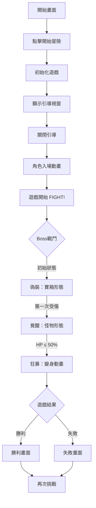

# 🎮 Vibe Coding Dungeon - 專案狀態總覽

## 📁 專案結構

```
C:\Users\leoch\Documents\GitHub\pixel\
├── index.html              # 主遊戲檔案 (HTML5 Canvas遊戲)
├── game.html              # 備用遊戲檔案
├── boss-transform-fix.html # Boss變身修復測試檔
├── css\
│   └── game-styles.css    # 遊戲樣式
├── js\                    # JavaScript遊戲邏輯
│   ├── mimicBoss.js       # Boss類別實作
│   ├── boss-ai.js         # Boss AI系統
│   ├── game-engine.js    # 遊戲引擎
│   ├── particles.js       # 粒子效果系統
│   └── resourceLoader.js  # 資源載入器
├── Assets\
│   ├── Boss\
│   │   └── MimicBoss\
│   │       └── Sprites\
│   │           ├── Attack\      # 攻擊動畫 (7幀)
│   │           ├── Transform\   # 變身動畫 (9幀)
│   │           └── Idle\        # 待機動畫
│   └── Backgrounds\            # 背景圖片
│       ├── castle-background.png
│       └── dungeon-start-bg.png
├── audio\                      # 音效檔案
│   ├── level1-bgm.mp3
│   └── menu-bgm.mp3
├── Docs\                       # 專案文檔
└── Archive\                    # 封存的舊版本
```

## ✅ 已完成功能

### 核心遊戲系統
- [x] **遊戲引擎** - HTML5 Canvas基礎遊戲循環
- [x] **角色系統** - Player和MimicBoss類別
- [x] **物理系統** - 重力、跳躍、碰撞檢測
- [x] **戰鬥系統** - 攻擊、傷害、連擊計算
- [x] **動畫系統** - Boss多幀動畫系統（攻擊、變身、待機）
- [x] **3D變身特效** - Three.js整合的3D變身效果

### Boss戰鬥系統
- [x] **初始偽裝** - 寶箱形態，第一次受傷觸發覺醒
- [x] **覺醒狀態** - HP 50%-100%，顯露怪物形態
- [x] **狂暴變身** - HP ≤ 50%，觸發9幀變身動畫
- [x] **多樣化攻擊** - 金幣投射、咬擊、火球攻擊
- [x] **Boss AI系統** - 智能追擊、攻擊決策

### 使用者介面
- [x] **開始畫面** - 火焰特效背景
- [x] **引導視窗** - 操作說明
- [x] **遊戲HUD** - 血條、連擊、計時器
- [x] **結束畫面** - 勝利/失敗畫面
- [x] **觸控按鈕** - 手機版操作介面
- [x] **調試模式** - FPS顯示、碰撞框顯示

### 平台支援
- [x] **桌面版** - 鍵盤控制、全螢幕支援
- [x] **手機版** - 觸控控制、橫向提示
- [x] **響應式設計** - 自動適配不同螢幕

## 🔧 已修復問題

| 問題 | 狀態 | 解決方案 |
|------|------|----------|
| Boss變身動畫整合 | ✅ 已修復 | 實作9幀變身動畫系統 |
| 3D變身特效 | ✅ 已修復 | Three.js整合 |
| 變身期間無敵 | ✅ 已修復 | 變身標記控制 |
| 動畫載入路徑 | ✅ 已修復 | 正確的Assets路徑 |
| 觸控按鈕響應 | ✅ 已修復 | touch和mouse事件支援 |

## 🎮 遊戲流程



## 📊 技術規格

### Canvas設定
- 尺寸: 850x450px
- 渲染: 2D context + Three.js 3D層
- 像素化: `image-rendering: pixelated`

### 動畫系統
```javascript
// Boss動畫資源
- 攻擊動畫: 7幀 (0.08秒/幀)
- 變身動畫: 9幀 (0.12秒/幀)
- 覺醒階段動畫:
  - 待機: 2幀 (awakened_idle_frame1-2.png)
  - 受傷: 1幀 (awakened_hurt_frame1.png)
- 路徑: Assets/Boss/MimicBoss/Sprites/
```

### 控制方式
**桌面版:**
- ← → 或 A/D: 移動
- ↑ 或 W 或 Space: 跳躍  
- J 或 Z: 攻擊
- Shift: 衝刺
- F: 全螢幕切換

**手機版:**
- 虛擬搖桿: 控制移動
- 觸控按鈕: 跳躍、攻擊、衝刺

## 🎯 遊戲特色

1. **像素藝術風格** - 復古8位元視覺
2. **三階段Boss戰** - 漸進式難度提升
3. **3D變身特效** - Three.js視覺震撼
4. **連擊系統** - 精準打擊累積傷害
5. **跨平台支援** - 桌面和手機雙平台

## 📝 最新更新

### v2.0 - 完整Boss系統
- 實作三階段Boss戰鬥
- 整合9幀變身動畫
- 新增3D變身特效
- Boss AI智能系統
- 變身期間無敵機制

### v1.5 - 動畫系統強化
- Boss攻擊動畫7幀
- 動畫載入優化
- 幀序列控制系統

## 🚀 待開發功能

- [ ] 音效系統整合
- [ ] 更多Boss技能動畫
- [ ] 粒子特效強化
- [ ] 關卡系統
- [ ] 成就系統
- [ ] 存檔功能

## 📱 測試檢查清單

- [x] 遊戲正常啟動
- [x] Boss三階段正確觸發
- [x] 變身動畫正常播放
- [x] 3D特效正確顯示
- [x] 連擊系統正常
- [x] 重新開始功能
- [x] 手機觸控操作
- [x] 全螢幕模式

## 💻 開發環境

- 純HTML5/Canvas/JavaScript
- Three.js (CDN引入)
- 無需建置工具
- 直接開啟index.html即可遊玩

---

最後更新: 2025-08-30
專案狀態: 🟢 運作正常