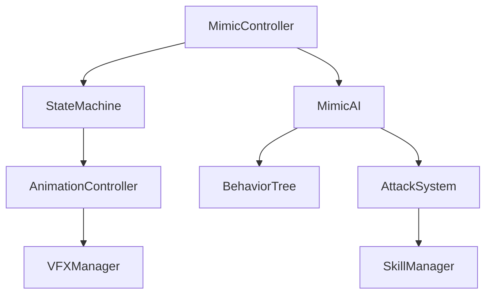

# 寶箱怪技術實作文檔

## 文檔資訊
- 版本：v1.0
- 更新日期：2025-08-27
- 程式團隊參考文檔

---

## 1. 系統架構設計

### 1.1 核心架構
```
MimicBoss/
├── Core/
│   ├── MimicController.cs      // 主控制器
│   ├── MimicStateMachine.cs    // 狀態機
│   └── MimicData.cs            // 數據配置
├── AI/
│   ├── MimicAI.cs              // AI主邏輯
│   ├── BehaviorTree.cs         // 行為樹
│   └── DecisionMaker.cs        // 決策系統
├── Combat/
│   ├── AttackSystem.cs         // 攻擊系統
│   ├── DamageCalculator.cs     // 傷害計算
│   └── SkillManager.cs         // 技能管理
└── Animation/
    ├── AnimationController.cs  // 動畫控制
    ├── AnimationEvents.cs      // 動畫事件
    └── VFXManager.cs           // 特效管理
```

### 1.2 組件依賴關係


---

## 2. 狀態機設計

### 2.1 狀態定義
```csharp
public enum MimicState
{
    Disguised,      // 偽裝狀態
    Awakening,      // 覺醒中
    Idle,           // 戰鬥待機
    Moving,         // 移動中
    Attacking,      // 攻擊中
    Hit,            // 受擊
    PhaseTransition,// 階段轉換
    Dying,          // 死亡中
    Dead            // 已死亡
}
```

### 2.2 狀態轉換規則
```csharp
// 狀態轉換配置
Dictionary<MimicState, List<MimicState>> validTransitions = new()
{
    [Disguised] = { Awakening },
    [Awakening] = { Idle },
    [Idle] = { Moving, Attacking, Hit, PhaseTransition, Dying },
    [Moving] = { Idle, Attacking, Hit },
    [Attacking] = { Idle, Hit },
    [Hit] = { Idle, Dying },
    [PhaseTransition] = { Idle },
    [Dying] = { Dead }
};
```

### 2.3 狀態行為實作
```csharp
public class DisguisedState : IState
{
    public void OnEnter() 
    {
        // 播放偽裝待機動畫
        // 關閉碰撞傷害
        // 啟用互動檢測
    }
    
    public void OnUpdate() 
    {
        // 檢測玩家距離
        if (PlayerInRange()) 
        {
            TransitionTo(MimicState.Awakening);
        }
    }
    
    public void OnExit() 
    {
        // 停止偽裝動畫
        // 觸發覺醒事件
    }
}
```

---

## 3. AI行為樹實作

### 3.1 行為樹結構
```csharp
public class MimicBehaviorTree
{
    private BehaviorNode rootNode = new Selector(
        new Sequence(  // 戰鬥序列
            new ConditionNode(IsPlayerInRange),
            new Selector(
                new Sequence(  // 近戰
                    new ConditionNode(IsCloseRange),
                    new ActionNode(PerformMeleeAttack)
                ),
                new Sequence(  // 遠程
                    new ConditionNode(IsMidRange),
                    new ActionNode(PerformRangedAttack)
                ),
                new ActionNode(MoveToPlayer)  // 追擊
            )
        ),
        new ActionNode(ReturnToIdle)  // 默認
    );
}
```

### 3.2 決策權重系統
```csharp
public class AttackDecisionMaker
{
    private Dictionary<string, float> attackWeights = new()
    {
        ["Bite"] = 0.3f,
        ["TongueWhip"] = 0.25f,
        ["JumpAttack"] = 0.2f,
        ["GoldSpray"] = 0.15f,
        ["TrapSet"] = 0.1f
    };
    
    public string SelectAttack(float distance, int phase)
    {
        // 根據距離和階段調整權重
        var adjustedWeights = AdjustWeights(distance, phase);
        return WeightedRandom(adjustedWeights);
    }
}
```

---

## 4. 攻擊系統實作

### 4.1 攻擊數據結構
```csharp
[System.Serializable]
public class AttackData
{
    public string attackName;
    public float damage;
    public float range;
    public float cooldown;
    public float castTime;
    public AnimationClip animation;
    public GameObject effectPrefab;
    public AudioClip soundEffect;
    
    // 攻擊判定區域
    public enum HitboxType { Circle, Rectangle, Cone }
    public HitboxType hitboxType;
    public Vector2 hitboxSize;
    public float hitboxAngle;  // 用於扇形
}
```

### 4.2 技能實作範例
```csharp
// 舌頭鞭打實作
public class TongueWhipSkill : BaseSkill
{
    public override void Execute()
    {
        // 1. 播放預備動畫
        animator.Play("TongueWhip_Anticipation");
        
        // 2. 等待施法時間
        yield return new WaitForSeconds(castTime);
        
        // 3. 生成傷害區域
        var hitbox = CreateConeHitbox(
            transform.position,
            transform.forward,
            range: 5f,
            angle: 120f
        );
        
        // 4. 檢測命中
        var hits = Physics.OverlapBox(hitbox);
        foreach (var hit in hits)
        {
            if (hit.CompareTag("Player"))
            {
                // 造成傷害
                hit.GetComponent<IDamageable>()
                   .TakeDamage(damage);
                   
                // 施加減速
                hit.GetComponent<IStatusEffect>()
                   .ApplySlow(0.5f, 3f);
            }
        }
        
        // 5. 播放特效
        Instantiate(tongueWhipVFX, hitbox.center);
        AudioSource.PlayClipAtPoint(whipSound, transform.position);
    }
}
```

### 4.3 金幣攻擊物理實作
```csharp
public class GoldCoinProjectile : MonoBehaviour
{
    private Rigidbody rb;
    private int bounceCount = 0;
    private const int maxBounces = 3;
    
    void Start()
    {
        rb = GetComponent<Rigidbody>();
        // 拋物線初速度
        rb.velocity = CalculateProjectileVelocity();
    }
    
    void OnCollisionEnter(Collision collision)
    {
        if (collision.gameObject.CompareTag("Ground"))
        {
            if (bounceCount < maxBounces)
            {
                // 彈跳邏輯
                bounceCount++;
                rb.velocity = Vector3.Reflect(
                    rb.velocity, 
                    collision.contacts[0].normal
                ) * 0.7f;  // 能量損失
                
                // 播放金幣彈跳音效
                PlayBounceSound();
            }
            else
            {
                // 停止並變成可拾取狀態
                rb.isKinematic = true;
                EnablePickup();
            }
        }
    }
}
```

---

## 5. 動畫系統整合

### 5.1 動畫控制器配置
```csharp
public class MimicAnimationController : MonoBehaviour
{
    private Animator animator;
    private Dictionary<string, int> animationHashes;
    
    void Awake()
    {
        // 預計算動畫哈希值以提升性能
        animationHashes = new Dictionary<string, int>
        {
            ["Idle_Disguise"] = Animator.StringToHash("Idle_Disguise"),
            ["Transform_Awaken"] = Animator.StringToHash("Transform_Awaken"),
            ["Attack_Bite"] = Animator.StringToHash("Attack_Bite"),
            // ... 其他動畫
        };
    }
    
    public void PlayAnimation(string animName, float crossfade = 0.1f)
    {
        if (animationHashes.TryGetValue(animName, out int hash))
        {
            animator.CrossFade(hash, crossfade);
        }
    }
}
```

### 5.2 動畫事件系統
```csharp
public class AnimationEventHandler : MonoBehaviour
{
    // 在動畫中調用的事件
    public void OnBiteHit()
    {
        // 咬擊判定時機
        CheckBiteDamage();
        PlayBiteSound();
        SpawnBiteVFX();
    }
    
    public void OnLandImpact()
    {
        // 落地衝擊
        CameraShake(intensity: 0.5f, duration: 0.3f);
        SpawnDustCloud();
        CreateShockwave();
    }
    
    public void OnGoldCoinSpawn()
    {
        // 生成金幣
        SpawnGoldCoinWave();
    }
}
```

---

## 6. 效能優化策略

### 6.1 物件池系統
```csharp
public class ProjectilePool : MonoBehaviour
{
    private Queue<GameObject> goldCoinPool = new Queue<GameObject>();
    private int poolSize = 50;
    
    void Start()
    {
        // 預生成物件
        for (int i = 0; i < poolSize; i++)
        {
            var coin = Instantiate(goldCoinPrefab);
            coin.SetActive(false);
            goldCoinPool.Enqueue(coin);
        }
    }
    
    public GameObject GetGoldCoin()
    {
        if (goldCoinPool.Count > 0)
        {
            var coin = goldCoinPool.Dequeue();
            coin.SetActive(true);
            return coin;
        }
        return Instantiate(goldCoinPrefab);
    }
    
    public void ReturnGoldCoin(GameObject coin)
    {
        coin.SetActive(false);
        goldCoinPool.Enqueue(coin);
    }
}
```

### 6.2 LOD系統實作
```csharp
public class MimicLODController : MonoBehaviour
{
    private float[] lodDistances = { 10f, 25f, 50f };
    
    void Update()
    {
        float distance = Vector3.Distance(
            transform.position, 
            Camera.main.transform.position
        );
        
        if (distance < lodDistances[0])
        {
            SetLOD(0);  // 完整細節
        }
        else if (distance < lodDistances[1])
        {
            SetLOD(1);  // 中等細節
        }
        else if (distance < lodDistances[2])
        {
            SetLOD(2);  // 低細節
        }
        else
        {
            SetLOD(3);  // 極低細節
        }
    }
    
    void SetLOD(int level)
    {
        switch(level)
        {
            case 0:
                animator.enabled = true;
                particleSystem.maxParticles = 100;
                break;
            case 1:
                animator.enabled = true;
                particleSystem.maxParticles = 50;
                break;
            case 2:
                animator.enabled = false;
                particleSystem.maxParticles = 10;
                break;
            case 3:
                gameObject.SetActive(false);
                break;
        }
    }
}
```

---

## 7. 網路同步（多人遊戲）

### 7.1 狀態同步
```csharp
[NetworkBehavior]
public class MimicNetworkSync : NetworkBehaviour
{
    [SyncVar(OnChange = nameof(OnStateChanged))]
    private MimicState syncedState;
    
    [SyncVar]
    private float syncedHealth;
    
    [SyncVar]
    private int syncedPhase;
    
    [Command]
    void CmdPerformAttack(string attackType)
    {
        // 驗證攻擊合法性
        if (ValidateAttack(attackType))
        {
            // 廣播給所有客戶端
            RpcExecuteAttack(attackType);
        }
    }
    
    [ClientRpc]
    void RpcExecuteAttack(string attackType)
    {
        // 所有客戶端執行攻擊動畫
        attackManager.ExecuteAttack(attackType);
    }
}
```

---

## 8. 配置文件格式

### 8.1 JSON配置範例
```json
{
  "mimicBossConfig": {
    "baseStats": {
      "health": 500,
      "defense": 20,
      "moveSpeed": 3.5
    },
    "phases": [
      {
        "phaseNumber": 1,
        "healthRange": [0.6, 1.0],
        "attackSpeedMultiplier": 1.0,
        "damageMultiplier": 1.0,
        "availableAttacks": ["Bite", "TongueWhip", "Jump"]
      },
      {
        "phaseNumber": 2,
        "healthRange": [0.3, 0.6],
        "attackSpeedMultiplier": 1.3,
        "damageMultiplier": 1.2,
        "availableAttacks": ["Bite", "TongueWhip", "Jump", "GoldSpray", "Trap"]
      },
      {
        "phaseNumber": 3,
        "healthRange": [0.0, 0.3],
        "attackSpeedMultiplier": 1.5,
        "damageMultiplier": 1.5,
        "availableAttacks": ["All"],
        "specialEffects": ["Rage", "GoldDrop"]
      }
    ],
    "attacks": {
      "Bite": {
        "damage": 30,
        "cooldown": 2,
        "range": 2,
        "animationTime": 0.5
      },
      "TongueWhip": {
        "damage": 25,
        "cooldown": 3,
        "range": 5,
        "animationTime": 0.833,
        "statusEffect": {
          "type": "Slow",
          "value": 0.5,
          "duration": 3
        }
      }
    }
  }
}
```

---

## 9. 調試工具

### 9.1 Debug面板
```csharp
#if UNITY_EDITOR
public class MimicDebugPanel : MonoBehaviour
{
    [Header("Debug Controls")]
    [SerializeField] private bool showHitboxes = false;
    [SerializeField] private bool showAIDecisions = false;
    [SerializeField] private bool immortalMode = false;
    
    [Header("State Override")]
    [SerializeField] private MimicState forceState;
    [SerializeField] private bool overrideState = false;
    
    [Header("Stats Monitor")]
    [ReadOnly] public float currentHealth;
    [ReadOnly] public MimicState currentState;
    [ReadOnly] public string lastAttack;
    [ReadOnly] public float[] cooldowns;
    
    void OnDrawGizmos()
    {
        if (showHitboxes)
        {
            DrawAttackHitboxes();
        }
        
        if (showAIDecisions)
        {
            DrawAIDebugInfo();
        }
    }
}
#endif
```

---

## 10. 整合測試清單

### 10.1 功能測試
- [ ] 偽裝狀態檢測
- [ ] 覺醒觸發條件
- [ ] 各攻擊技能執行
- [ ] 階段轉換流暢性
- [ ] 受擊反饋
- [ ] 死亡流程
- [ ] 獎勵掉落

### 10.2 性能測試
- [ ] FPS穩定性（目標60）
- [ ] 記憶體使用（<100MB）
- [ ] Draw Call數量（<50）
- [ ] 物理計算優化
- [ ] 粒子系統效能

### 10.3 邊界測試
- [ ] 極限距離行為
- [ ] 同時多個Boss
- [ ] 極快擊殺
- [ ] 卡牆檢測
- [ ] 異常狀態處理

---

## 更新日誌
- 2025-08-27: 初版技術文檔建立